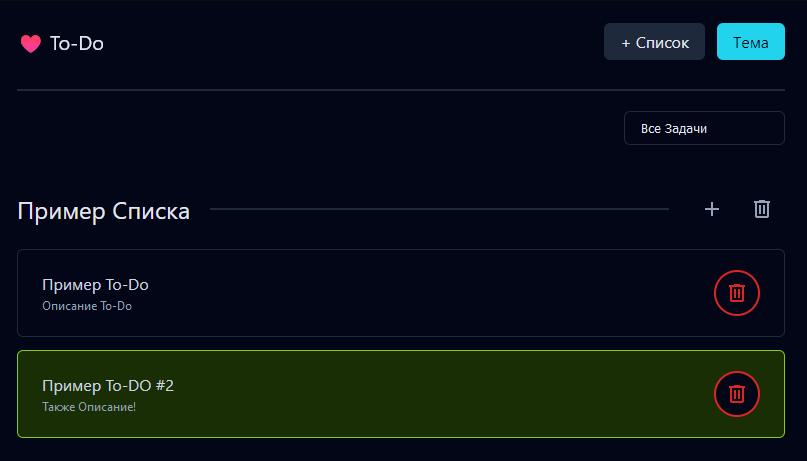

### To-Do Список
Выполненное Тестовое Задание, сделано без каких-либо библиотек и фреймворков, на чистом JavaScript & HTML & CSS. Код также полностью задокументирован, все основные функции имеют JSDocs. Дизайн также сделан самостоятельно, единственный нюанс: Стилистика дизайна вдохновлена Shadcn-UI (Только стили, сам набор компонентов использован не был). Верстка адаптивная и кроссбраузерная.

### Запуск
Достаточно просто запустить index.html в браузере.

### Функции
- Создание отдельных списков
- Создание элементов to-do внутри списков
- Удаление списков & элементов to-do
- Темная и Светлая темы
- Фильтры: Все | Активные | Выполненные

### Изображение Сайта

